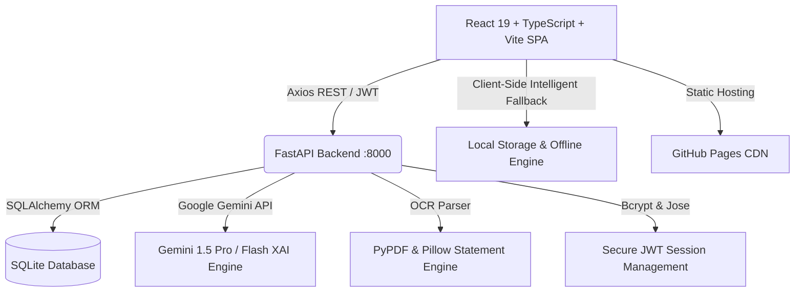

# 💳 Credit Assistant 2.0 - AI-Powered Financial Health Advisor

[](https://aryaman174757-code.github.io/credit-assistant-2.0/)
[](https://github.com/aryaman174757-code/credit-assistant-2.0)
[](https://fastapi.tiangolo.com/)
[](https://react.dev/)
[](https://www.typescriptlang.org/)
[](LICENSE)

An **Enterprise-Grade SaaS FinTech Web Application** engineered specifically for the Indian Financial Ecosystem (BFSI). Features **Explainable AI (XAI)**, multi-horizon **CIBIL credit score trajectory prediction**, automated **FOIR & EMI affordability calculation**, bank statement **OCR scanner**, and Indian merchant **expense intelligence**.

---

## 🌐 Public Live Access Links

- 🚀 **Live Production Application**: **[https://aryaman174757-code.github.io/credit-assistant-2.0/](https://aryaman174757-code.github.io/credit-assistant-2.0/)**
- 📦 **Source Code Repository**: **[https://github.com/aryaman174757-code/credit-assistant-2.0](https://github.com/aryaman174757-code/credit-assistant-2.0)**
- ⚡ **Instant 1-Click Access**: No registration required! Simply click **"One-Click Demo Account (Instant Access)"** on the [Sign In Page](https://aryaman174757-code.github.io/credit-assistant-2.0/#/login).

### 🔑 Demo Account Credentials
- **Email**: `demo@creditassistant.ai`
- **Password**: `password123`
- *(Or register any new custom profile via the [Create Account Page](https://aryaman174757-code.github.io/credit-assistant-2.0/#/register))*

---

## ✨ Core Features & Capabilities

| Module | Description | Key Metric / Tech |
| :--- | :--- | :--- |
| **🧠 Explainable AI Advisor (XAI)** | Transparent financial diagnostics with benchmark evidence and actionable sequential roadmaps. | English, Hindi (हिन्दी), Marathi (मराठी) |
| **📈 CIBIL Prediction Engine** | 3-month and 6-month predictive credit score trajectory modeling under what-if debt paydown scenarios. | Recharts Area & Line Charts |
| **🧮 EMI & FOIR Calculator** | Comprehensive amortization schedules, Fixed Obligation to Income Ratio (FOIR), and debt-to-income (DTI) thresholds. | Low / Moderate / High Risk Slabs |
| **📄 OCR Bank Statement Scanner** | Upload PDF or image bank statements to automatically extract, parse, and categorize financial transactions. | PDF & Image Text Extraction |
| **🛍️ Expense Intelligence** | Automatic classification for top Indian payment merchants (Swiggy, Zomato, Blinkit, Amazon, Uber, UPI). | Categorical Spending Pie Charts |
| **🛡️ Fraud Shield & Security Center** | Real-time behavioral anomaly detection, location jump tracking, session management, and audit logging. | JWT Auth, Bcrypt, Audit Trails |
| **💎 Investment Readiness Index** | Comprehensive 0–100 health score analyzing emergency fund sufficiency, debt stability, and SIP allocation. | Mutual Funds, SGB, Liquid Debt |
| **👨‍👩‍👧‍👦 Family Financial Dashboard** | Aggregated household balance sheets and collective credit health for Indian joint families. | Household Savings Aggregator |
| **🗣️ Multilingual Voice Assistant** | Hands-free speech recognition supporting voice navigation across all dashboard modules. | Web Speech API |
| **💬 WhatsApp Meta Cloud Bot** | Simulated conversational banking assistant sending interactive CIBIL updates directly to WhatsApp. | Meta WhatsApp Cloud API |

---

## 🏛️ System Architecture



---

## 🚀 Local Development Setup

### Prerequisites
- **Node.js**: v18+ (tested on Node v24)
- **Python**: v3.10+ (tested on Python v3.14)
- **Git**

### 1. Clone Repository
```bash
git clone https://github.com/aryaman174757-code/credit-assistant-2.0.git
cd credit-assistant-2.0
```

### 2. One-Click Launch (Windows)
Double-click:
```powershell
.\start-all.bat
```
*(Starts both backend on `http://127.0.0.1:8000` and frontend on `http://localhost:5173`)*

### 3. Manual Launch

#### Backend (FastAPI):
```bash
cd backend
python -m venv venv
# On Windows:
venv\Scripts\activate
# On Linux/macOS:
source venv/bin/activate

pip install -r requirements.txt
python -m uvicorn app.main:app --host 127.0.0.1 --port 8000 --reload
```
- Interactive API Docs: `http://127.0.0.1:8000/docs`

#### Frontend (React 19 + TypeScript):
```bash
cd frontend
npm install
npm run dev
```
- Frontend App: `http://localhost:5173/`

---

## 🧪 Testing & Verification

Run backend unit tests:
```bash
cd backend
python -m pytest -v
```

Build frontend for production:
```bash
cd frontend
npm run build
```

---

## 📌 Project Structure

```
credit-assistant-2.0/
├── backend/
│   ├── app/
│   │   ├── core/         # Security, JWT, config, database session
│   │   ├── models/       # SQLAlchemy ORM models (User, Profile, Transactions, etc.)
│   │   ├── routers/      # API Endpoints (Auth, AI, Credit, EMI, Expenses, OCR, etc.)
│   │   ├── schemas/      # Pydantic validation schemas
│   │   ├── services/     # Business logic (XAI, CIBIL predictor, EMI, OCR)
│   │   └── main.py       # FastAPI application factory & seed data
│   ├── tests/            # Pytest test suite
│   └── requirements.txt  # Python dependencies
├── frontend/
│   ├── public/           # Static assets, 404.html for GitHub Pages SPA
│   ├── src/
│   │   ├── components/   # UI components (KPICard, CreditGauge, GlassCard, etc.)
│   │   ├── contexts/     # Auth, Financial, Language, Theme contexts
│   │   ├── pages/        # Dashboard & Public pages (18 responsive pages)
│   │   ├── services/     # Axios client with robust offline/demo fallbacks
│   │   ├── types/        # TypeScript interfaces
│   │   └── App.tsx       # Root HashRouter & Route guards
│   └── package.json
├── start-all.bat         # Single-click full-stack launcher
├── start-backend.bat     # Single-click backend launcher
├── start-frontend.bat    # Single-click frontend launcher
└── README.md
```

---

## 🔗 Quick Links & Bookmarks

- 🌐 **Live Website**: [https://aryaman174757-code.github.io/credit-assistant-2.0/](https://aryaman174757-code.github.io/credit-assistant-2.0/)
- 💻 **GitHub Repository**: [https://github.com/aryaman174757-code/credit-assistant-2.0](https://github.com/aryaman174757-code/credit-assistant-2.0)
- 🔑 **Instant Demo Login**: [https://aryaman174757-code.github.io/credit-assistant-2.0/#/login](https://aryaman174757-code.github.io/credit-assistant-2.0/#/login)
- 📝 **Register Account**: [https://aryaman174757-code.github.io/credit-assistant-2.0/#/register](https://aryaman174757-code.github.io/credit-assistant-2.0/#/register)

---

## 📄 License
This project is open-source and distributed under the **MIT License**.
